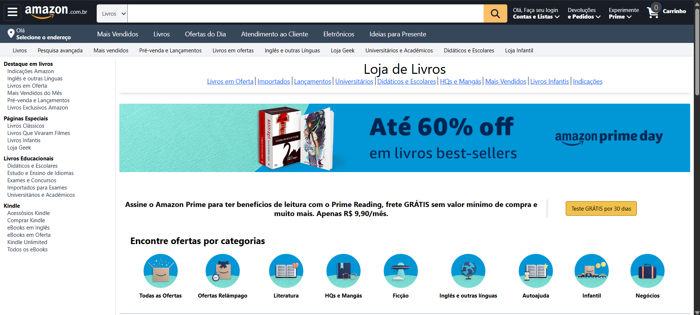

# 📚 Clone da Home Antiga de Livros da Amazon

Este projeto é um **clone da antiga página de livros da Amazon**, desenvolvido com o objetivo de **praticar o uso do Tailwind CSS** e aprofundar conhecimentos em construção de interfaces responsivas e bem estruturadas.

---

## 🎯 Objetivo

Recriar visualmente a página de livros da Amazon como forma de:

- Praticar a **estruturação com HTML5**
- Aplicar **Tailwind CSS** para estilização e responsividade
- Melhorar a organização e reutilização de classes utilitárias
- Reproduzir um layout real do mundo corporativo com atenção aos detalhes

---

## 🧪 Tecnologias Utilizadas

- **HTML5**
- **Tailwind CSS**

> 💡 O projeto foi feito com foco exclusivo em **estilização e layout**, por isso não possui funcionalidades com JavaScript.

---

## 📸 Prévia do Projeto
